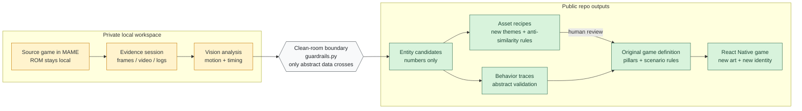
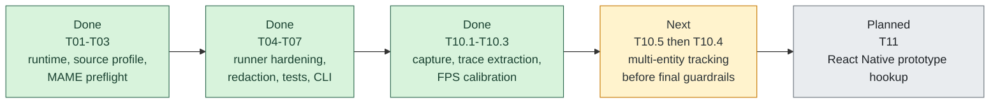
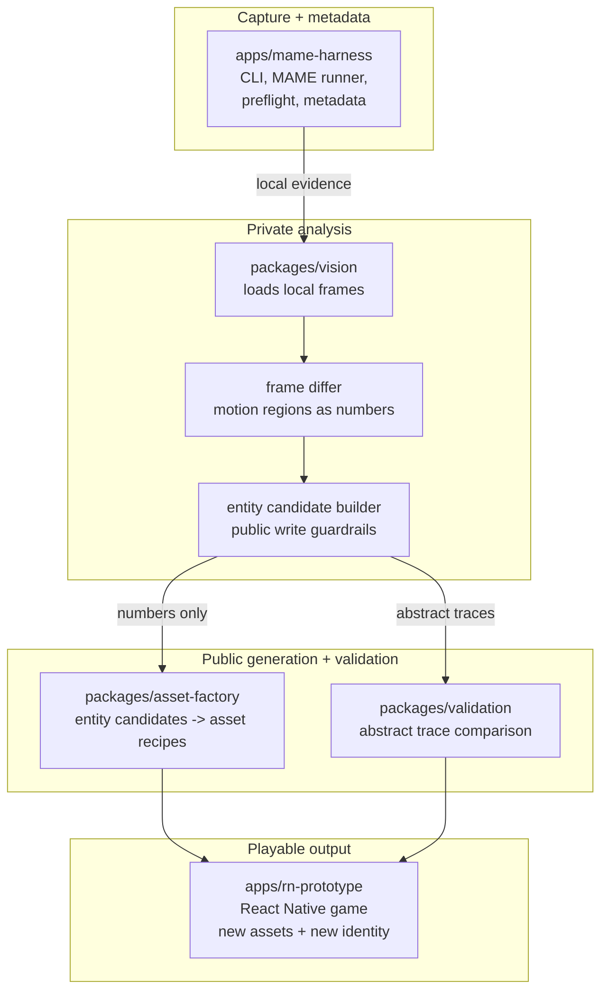
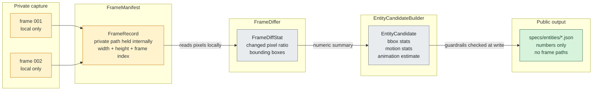

# blackbox_mame_game_abstraction

> Observe gameplay behavior. Extract abstract mechanics. Build something new.

## What this is

This repository is a clean-room game-abstraction framework. It observes a game running in MAME, keeps the raw evidence private, and turns the observed behavior into public mechanics data that can support an independent implementation with original art, a new theme, and a new identity.

The goal is not to preserve the original game's expressive material. The goal is to study how the game behaves: movement rhythm, timing windows, interaction patterns, encounter structure, and other mechanics that can be described abstractly and then reused in something new.

## Why this exists

Emulators help run games. TAS and debugging tools help inspect emulated execution. RL environments help train agents. Controller tools help map physical inputs. Those are useful building blocks, but they do not target this repository's output.

This project is aimed at a different handoff: observable behavior goes in, clean-room-safe mechanics artifacts come out. The output is meant to be implementation-ready in an abstract sense: numeric summaries, behavior traces, asset recipes, and public game-definition artifacts that can guide a new game without carrying original expressive content across the boundary.

## How it differs from adjacent tools

MAME and RetroArch help run games. BizHawk and related tooling help automate and inspect emulator behavior. Gym-style projects help train agents. Controller-mapping tools help bind hardware inputs.

This repository uses some of the same ecosystem ideas, but it targets a different result: a clean-room abstraction layer that converts observed gameplay behavior into public mechanics data, validation traces, and original-asset guidance for an independent implementation.

## What this is not

- not a ROM distribution project
- not an asset extraction tool
- not a game cloning pipeline
- not a generic emulator frontend
- not an RL training environment

## The core idea

```text
observe -> capture -> abstract -> validate -> reimplement independently
```

## Clean-room boundary

The framework separates observable behavior from expressive material. ROMs, screenshots, videos, frame dumps, sprites, audio, crops, and other source artifacts stay private. Public outputs stay limited to abstract mechanics, numeric summaries, behavioral traces, asset recipes, validation data, and original game-definition artifacts.

This is the hard rule of the repo: only abstract mechanics cross the boundary.

## Current case study

The first case study is Ghosts 'n Goblins (`gng.zip` via MAME driver `gngb`). The repository currently uses that subject to exercise the pipeline, but the architecture is intended for any game that can be observed through the same MAME-based boundary.

## Why layered input mapping was added

The input mapping flow is being pushed toward explicit layers so contributors do not have to jump straight from a physical keyboard or controller to game-specific actions and fragile boot timings.

```text
physical device -> canonical controller -> game action -> observable effect -> abstract rule
```

At the repository level, that means public mapping profiles can stay reusable and clean-room safe before they are compiled into the existing deterministic input-plan pipeline.

---

## The idea in one diagram



The private zone is where local evidence lives: ROM files, raw pixel captures, video, and logs. The public zone is where shareable outputs live: numbers, recipes, behavioral specs, and original game-definition artifacts. The code enforces that boundary at write time.

---

## What comes out of it

Everything in `specs/` is tracked in git and safe to share. Here is what the output looks like:

**Entity candidate** — a moving object detected from frame diffs, described purely in numbers:
```json
{
  "candidate_id": "entity_0",
  "bbox_stats": { "min_w": 16, "max_w": 24, "min_h": 20, "max_h": 24 },
  "motion_stats": { "mean_velocity": 2.1, "max_displacement": 14 },
  "animation_estimate": { "frame_count": 4 }
}
```

**Asset recipe** — instructions for an artist or generative tool to make something *new*:
```yaml
candidate_id: entity_0
gameplay_role: ground_enemy
size_class: small
motion_feel: patrol_ground
prohibited_similarity_rules:
  - do not reuse original palette
  - do not copy original silhouette
  - do not copy character identity
  - do not use original crop as reference input
  - do not copy animation frames
originality_guard:
  human_review_required: true
suggested_new_theme_variants:
  - neon archaeology
  - paper automata
  - signal garden
```

The public output is intentionally abstract: mechanics data, asset recipes, validation traces, and future original game-definition artifacts.

---

## Current status

The repo is past dry-run setup. The GNG source profile, runner hardening, redaction policy, contract tests, CLI integration, frame-by-frame trace extraction, and FPS calibration are all in place.

Current milestone:

- T01-T07: complete
- T10.1-T10.3: complete
- Manual capture helpers are in repo: `scripts/launch_manual_capture.sh` and `scripts/extract_frames.sh`
- Public trace generation now targets `specs/traces/gng_trace.json` from private evidence under `evidence/private/`
- Current known next blockers: T10.4 guardrail verification on the final trace and T10.5 ArthurTracker multi-entity work
- Latest green baseline referenced by the task docs: `243` tests passed



After T10/T11, the next documented phase is T12: Original Game Definition. T12 defines Signal Garden as a working original direction and adds gameplay pillars, encounter grammar, scene recipes, transformation rules, progression, and originality validation before the RN prototype moves beyond clean-room mechanics playback.

---

## Quick start

You need Python 3.11, MAME, ffmpeg, and the harness virtualenv. A ROM is required for real capture. Keep local machine details in `.env` or `blackbox.local.yaml`, not in tracked files.

```bash
python3.11 -m venv apps/mame-harness/.venv
source apps/mame-harness/.venv/bin/activate
pip install -e '.[dev]'

# Verify your local bootstrap first
cp .env.example .env
apps/mame-harness/.venv/bin/python apps/mame-harness/cli.py doctor

# Then verify the run path in dry-run mode
apps/mame-harness/.venv/bin/python apps/mame-harness/cli.py run --rom gng --dry-run --frames-to-run 300

# Run tests with the supported interpreter
apps/mame-harness/.venv/bin/pytest -q
```

The doctor command checks MAME, ffmpeg, source-profile and driver alignment, ROM-path configuration, and writable private evidence directories without printing local machine paths. The dry run then builds the same command and metadata path the real capture would use while skipping the ROM-backed recording step. After that, the tests check the clean-room contract for private path isolation, blocked evidence formats, trace output safety, and asset recipes with originality rules.

Layered input mapping docs: [`docs/mapping.md`](docs/mapping.md)

Portable machine bootstrap: [`docs/bootstrap.md`](docs/bootstrap.md)

Full pipeline commands:

```bash
apps/mame-harness/.venv/bin/python apps/mame-harness/cli.py init
apps/mame-harness/.venv/bin/python apps/mame-harness/cli.py run --rom gng --rom-path /path/to/roms --input-plan plans/gng_gameplay.yaml --frames-to-run 300
apps/mame-harness/.venv/bin/python apps/mame-harness/cli.py analyze-placeholder \
  --run-id <run-id> \
  --output specs/entities/entity_candidates.generated.json
apps/mame-harness/.venv/bin/python apps/mame-harness/cli.py extract-trace \
  --run-id <run-id> \
  --input-plan plans/gng_gameplay.yaml \
  --output specs/traces/gng_trace.json
apps/mame-harness/.venv/bin/python apps/mame-harness/cli.py generate-asset-recipes-placeholder --entity-candidates specs/entities/entity_candidates.generated.json
apps/mame-harness/.venv/bin/python apps/mame-harness/cli.py validate-placeholder \
  --observed-trace specs/validation/sample_observed_trace.json \
  --simulated-trace specs/validation/sample_simulated_trace.json
```

Manual local recording flow:

```bash
./scripts/launch_manual_capture.sh
./scripts/extract_frames.sh manual_01
```

---

## How it works

Four layers, strict one-way data flow. Each layer enforces the contract with the one below it.



### How a raw frame becomes a public number

The private filesystem path disappears at the `FrameDiffer` boundary — the output type has no path field. This is a type-level guarantee, not a runtime filter.



---

## Guardrails

Every public file write passes three runtime checks before touching disk:

1. **Extension blocklist** — `.png`, `.jpg`, `.mp4`, `.zip`, `.rom`, `.bin`, `.state`, `.sav` and others raise `ValueError` immediately.
2. **Directory blocklist** — writing into `frames/`, `crops/`, `screenshots/`, `states/` raises `ValueError` even for safe extensions.
3. **Payload scan** — every string value in the output dict is recursively scanned. Any value containing `evidence/private/`, `/frames/`, or `/crops/` raises `ValueError` before the file is opened.

Command-line paths are rewritten to opaque `private://run-id/...` URIs before they reach any public writer.

Details: [`apps/mame-harness/guardrails.py`](apps/mame-harness/guardrails.py) · [`docs/adr/`](docs/adr/)

---

## Repository layout

```
apps/
  mame-harness/     CLI, runner, capture, input planning, redacted metadata writer
  rn-prototype/     TypeScript game engine — consumes public specs only
packages/
  vision/           Private frame analysis → numeric entity candidates
  asset-factory/    Abstract recipe generation with originality guardrails
  validation/       Behavioral diff and trace-based reports
  schemas/          JSON schemas for all public artifacts
plans/              Input plan YAML files (reproducible frame sequences)
specs/              Public output artifacts — tracked in git
evidence/private/   Gitignored private captures
docs/
  adr/              Architecture Decision Records (ADR-001 through ADR-018)
  obsidian/         Obsidian vault with module notes and wikilinks
```

---

## Contributing

The pipeline is stable and ready to extend. Each area has a focused entry point, so you can start where your interests fit best:

| Area | Where to start | Effort |
|------|---------------|--------|
| Add a second game (any MAME title) | [`source_profiles.py`](apps/mame-harness/source_profiles.py) — add a `SourceProfile` dataclass, ~30 lines | Small |
| Multi-entity vision tracking | [`packages/vision/`](packages/vision/) — current trace extraction is real, but player/enemy separation still needs T10.5 ArthurTracker work | Medium |
| Richer asset recipes (varied themes per entity) | [`recipe_generator.py`](packages/asset-factory/recipe_generator.py) — `suggested_new_theme_variants` is hardcoded | Small |
| Original game definition | [`original_game_definition_plan.md`](docs/plans/original_game_definition_plan.md) — T12 pillars, encounter grammar, scene recipes, and originality validation | Medium |
| React Native prototype scene | [`apps/rn-prototype/`](apps/rn-prototype/) — wire one scene to `specs/` outputs | Medium |

## Feedback wanted

This project is still early, and feedback is especially useful around the clean-room boundary, MAME capture assumptions, mechanics schemas, originality rules for asset recipes, and the React Native runtime direction.

Questions, concerns, or design ideas are welcome. Open an issue or reach out directly at [kruk.matias@gmail.com](mailto:kruk.matias@gmail.com). The architectural decisions behind every boundary are documented in [`docs/adr/`](docs/adr/).
