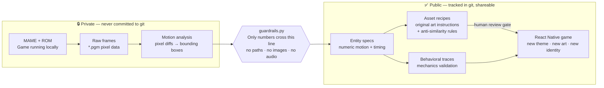
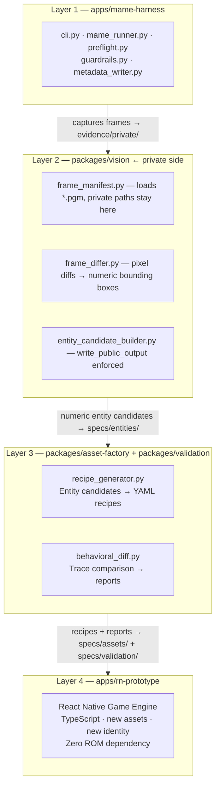
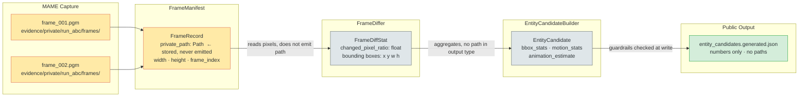

# blackbox_mame_game_abstraction

> Reverse-engineer a game's *feel* without reverse-engineering its *assets*.

This framework observes a game running in MAME, extracts its mechanics as abstract numbers, and uses those numbers to drive a new independent mobile game — built from scratch with original art and a new identity.

**Current subject:** Ghosts 'n Goblins (`gng.zip` via MAME driver `gngb`) — the first case study. The architecture works for any MAME-observable game: swap the source profile and the rest of the pipeline follows.

The core insight is that *behavior is not copyright*. Jump arcs, enemy timing, hitbox rhythms — those can be abstracted into specifications with nothing to do with the original sprites, audio, or source code. This project builds the tooling to do that systematically and verifiably.

---

## The idea in one diagram



The private zone can contain anything — ROM files, raw pixel captures, video, logs. None of it ever touches the public zone. The guardrails are enforced in code at write time, not by convention.

---

## What comes out of it

Everything in `specs/` is tracked in git and safe to share. Here is what the output looks like:

**Entity candidate** — a moving object detected from frame diffs, described purely in numbers:
```json
{
  "candidate_id": "entity_0",
  "bbox_stats": { "min_w": 16, "max_w": 24, "min_h": 20, "max_h": 24 },
  "motion_stats": { "mean_velocity": 2.1, "max_displacement": 14 },
  "animation_estimate": { "frame_count": 4 }
}
```

**Asset recipe** — instructions for an artist or generative tool to make something *new*:
```yaml
candidate_id: entity_0
gameplay_role: ground_enemy
size_class: small
motion_feel: patrol_ground
prohibited_similarity_rules:
  - do not reuse original palette
  - do not copy original silhouette
  - do not copy character identity
  - do not use original crop as reference input
  - do not copy animation frames
originality_guard:
  human_review_required: true
suggested_new_theme_variants:
  - neon archaeology
  - paper automata
  - signal garden
```

No sprites. No screenshots. No paths to private evidence.

---

## Current status

T01–T07 are complete. The pipeline runs end-to-end in dry-run mode. T08 is the first real MAME capture.

```mermaid
flowchart LR
    T01["✅ T01\nPython 3.11\nRuntime"]
    T02["✅ T02\nGNG Source\nProfile"]
    T03["✅ T03\nMAME + ROM\nPreflight"]
    T04["✅ T04\nMAME Runner\nHardening"]
    T05["✅ T05\nRedaction\nHardening"]
    T06["✅ T06\nContract\nTests"]
    T07["✅ T07\nCLI Profile\nIntegration"]
    T08["🔲 T08\nFirst Real\nGNG Capture"]
    T09["🔲 T09\nAbstract Obs.\nSchema"]
    T10["🔲 T10\nEvidence to\nPublic Spec"]
    T11["🔲 T11\nRN Prototype\nHookup"]

    T01 --> T02 --> T03 --> T04 --> T05 --> T06 --> T07 --> T08 --> T09 --> T10 --> T11

    classDef done fill:#00b894,stroke:#00cec9,color:#fff
    classDef planned fill:#636e72,stroke:#b2bec3,color:#fff
    class T01,T02,T03,T04,T05,T06,T07 done
    class T08,T09,T10,T11 planned
```



---

## Quick start

You need Python 3.11 and MAME installed. A ROM is required locally but is never committed.

```bash
python3.11 -m venv .venv && source .venv/bin/activate
pip install -e '.[dev]'

# Verify your setup without a ROM
python3.11 apps/mame-harness/cli.py run --rom gng --dry-run --frames-to-run 300

# Run tests
python3.11 -m pytest
```

Full pipeline commands:

```bash
python3.11 apps/mame-harness/cli.py init
python3.11 apps/mame-harness/cli.py run --rom gng --rom-path /path/to/roms --frames-to-run 300
python3.11 apps/mame-harness/cli.py analyze-placeholder --run-id <run-id>
python3.11 apps/mame-harness/cli.py generate-asset-recipes-placeholder --entity-candidates specs/entities/entity_candidates.generated.json
python3.11 apps/mame-harness/cli.py validate-placeholder \
  --observed-trace specs/validation/sample_observed_trace.json \
  --simulated-trace specs/validation/sample_simulated_trace.json
```

---

## How it works

Four layers, strict one-way data flow. Each layer enforces the contract with the one below it.



### How a raw frame becomes a public number

The private filesystem path disappears at the `FrameDiffer` boundary — the output type has no path field. This is a type-level guarantee, not a runtime filter.



---

## Guardrails

Every public file write passes three runtime checks before touching disk:

1. **Extension blocklist** — `.png`, `.jpg`, `.mp4`, `.zip`, `.rom`, `.bin`, `.state`, `.sav` and others raise `ValueError` immediately.
2. **Directory blocklist** — writing into `frames/`, `crops/`, `screenshots/`, `states/` raises `ValueError` even for safe extensions.
3. **Payload scan** — every string value in the output dict is recursively scanned. Any value containing `evidence/private/`, `/frames/`, or `/crops/` raises `ValueError` before the file is opened.

Command-line paths are rewritten to opaque `private://run-id/...` URIs before they reach any public writer.

Details: [`apps/mame-harness/guardrails.py`](apps/mame-harness/guardrails.py) · [`docs/adr/`](docs/adr/)

---

## Repository layout

```
apps/
  mame-harness/     CLI, runner, capture, input planning, redacted metadata writer
  rn-prototype/     TypeScript game engine — consumes public specs only
packages/
  vision/           Private frame analysis → numeric entity candidates
  asset-factory/    Abstract recipe generation with originality guardrails
  validation/       Behavioral diff and trace-based reports
  schemas/          JSON schemas for all public artifacts
plans/              Input plan YAML files (reproducible frame sequences)
specs/              Public output artifacts — tracked in git
evidence/private/   Private captures — gitignored, never committed
docs/
  adr/              Architecture Decision Records (ADR-001 through ADR-009)
  obsidian/         Obsidian vault with module notes and wikilinks
```

---

## Contributing

The pipeline is stable and ready to extend. You don't need to understand the whole codebase to contribute — pick an entry point that matches your interest:

| Area | Where to start | Effort |
|------|---------------|--------|
| Add a second game (any MAME title) | [`source_profiles.py`](apps/mame-harness/source_profiles.py) — add a `SourceProfile` dataclass, ~30 lines | Small |
| Real vision analysis (replace the stub) | [`packages/vision/`](packages/vision/) — `frame_differ.py` outputs synthetic data today; swap in real CV | Medium |
| Richer asset recipes (varied themes per entity) | [`recipe_generator.py`](packages/asset-factory/recipe_generator.py) — `suggested_new_theme_variants` is hardcoded | Small |
| React Native prototype scene | [`apps/rn-prototype/`](apps/rn-prototype/) — wire one scene to `specs/` outputs | Medium |

Questions or ideas? Open an issue or reach out directly at [kruk.matias@gmail.com](mailto:kruk.matias@gmail.com) — the architectural decisions behind every boundary are documented in [`docs/adr/`](docs/adr/).
