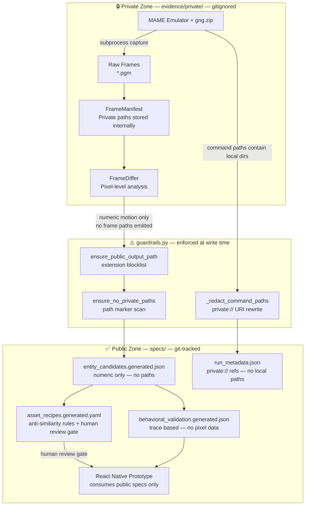
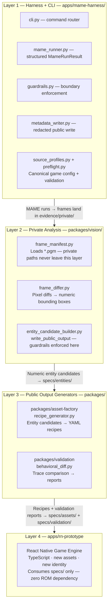
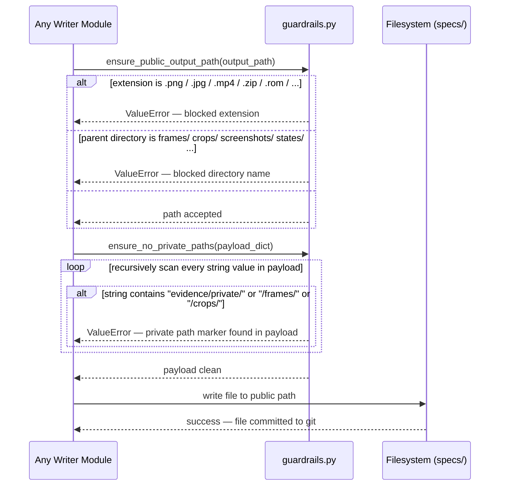

# Visual Architecture — blackbox_mame_game_abstraction

This document explains the project's core concepts through five diagrams. Each diagram covers a different angle of the same system.

---

## Diagram 1 — The Clean-Room Pipeline

The philosophical core of the entire project. A game is observed privately, its behavior is abstracted into numbers, and those numbers drive an independent original implementation. Copyright-protected content never crosses from the private zone into public outputs.

**Key insight:** The boundary is not a policy, it is a runtime invariant. `guardrails.py` raises `ValueError` if any public write attempt carries a private path. The pipeline cannot accidentally leak — it fails loudly.

---

## Diagram 2 — Four-Layer Architecture

The codebase is organized into four layers with increasing abstraction. Data flows strictly downward. The React Native prototype sits at the top consuming only public artifacts.

**Key insight:** Each layer boundary enforces a data contract. Layer 2 reads private paths internally but the contract with Layer 3 is: *numeric values only, no paths*. This is enforced in code at `entity_candidate_builder.py:write_public_output`.

---

## Diagram 3 — Guardrails Enforcement at Write Time

This shows what happens every time any module tries to write a file to the public output directory. The three-layer check happens synchronously — a failure raises `ValueError` immediately before any bytes are written.

**Key insight:** The three layers catch different attack surfaces. Extension check stops obvious evidence files. Directory check stops evidence-adjacent layouts. Payload scan stops the subtle case where a path string is embedded *inside* a JSON or YAML value.

---

## Diagram 4 — Frame to Spec: How a Private Pixel Becomes a Public Number

This traces one piece of data — a raw PGM frame — from the moment MAME writes it to disk, through analysis, to the final JSON output. The critical transformation is where the private path disappears and only a number remains.

```mermaid
flowchart LR
    subgraph CAP["MAME Capture Output"]
        f1["frame_001.pgm\nevidence/private/run_abc/frames/"]
        f2["frame_002.pgm\nevidence/private/run_abc/frames/"]
    end

    subgraph MANI["FrameManifest — frame_manifest.py"]
        fm["FrameRecord\nprivate_path: Path  ← stored but never emitted\nwidth: int\nheight: int\nframe_index: int"]
    end

    subgraph DIFF["FrameDiffer — frame_differ.py"]
        fd["FrameDiffStat\nchanged_pixel_ratio: float\nchanged_regions: list of BBox\n  x: int, y: int, w: int, h: int"]
    end

    subgraph ECB["EntityCandidateBuilder — entity_candidate_builder.py"]
        ec["EntityCandidate\ncandidate_id: str\nbbox_stats: min_w max_w min_h max_h\nmotion_stats: mean_velocity max_displacement\nanimation_estimate: frame_count"]
    end

    subgraph OUT["Public Output — specs/entities/"]
        json["entity_candidates.generated.json\ngit-tracked · no paths · numbers only"]
    end

    f1 --> fm
    f2 --> fm
    fm -->|"reads pixels via private_path\ndoes NOT emit the path"| fd
    fd -->|"aggregates across frames\nno path in output"| ec
    ec -->|"ensure_public_output_path\nensure_no_private_paths"| json

    classDef private fill:#ffeaa7,stroke:#e17055,color:#2d3436
    classDef transform fill:#dfe6e9,stroke:#636e72,color:#2d3436
    classDef public fill:#d4edda,stroke:#28a745,color:#2d3436

    class f1,f2,fm private
    class fd,ec transform
    class json public
```

**Key insight:** `FrameRecord.private_path` is the last node that knows the real filesystem path. `FrameDiffer` receives `FrameRecord` objects but its output type `FrameDiffStat` has no path field. The path is *architecturally excluded* from the output type, not just filtered at runtime.

---

## Diagram 5 — GNG Integration Task Progress

Current status of the GNG Source Integration stage (T01–T11). Tasks are strictly sequential — each depends on the stabilized contract from all prior tasks.

```mermaid
flowchart LR
    T01["✅ T01\nPython 3.11\nRuntime"]
    T02["✅ T02\nGNG Source\nProfile"]
    T03["✅ T03\nMAME + ROM\nPreflight"]
    T04["✅ T04\nMAME Runner\nHardening"]
    T05["✅ T05\nRedaction\nHardening"]
    T06["✅ T06\nContract\nTests"]
    T07["✅ T07\nCLI Profile\nIntegration"]
    T08["🔲 T08\nFirst Real\nGNG Capture"]
    T09["🔲 T09\nAbstract Obs.\nSchema"]
    T10["🔲 T10\nEvidence to\nPublic Spec"]
    T11["🔲 T11\nRN Prototype\nHookup"]

    T01 --> T02 --> T03 --> T04 --> T05 --> T06 --> T07 --> T08 --> T09 --> T10 --> T11

    classDef done fill:#00b894,stroke:#00cec9,color:#fff
    classDef planned fill:#636e72,stroke:#b2bec3,color:#fff

    class T01,T02,T03,T04,T05,T06,T07 done
    class T08,T09,T10,T11 planned
```

**Stage exit criteria:** T11 is complete when the RN prototype loads one scene driven entirely by public abstract specs, with no reference to ROMs, frames, or private evidence.

---

## Quick Reference: What Is Allowed vs Blocked

| Artifact type | Allowed in `specs/` | Blocked by |
|---|---|---|
| Abstract mechanics JSON | ✅ | — |
| Entity candidate JSON (numeric) | ✅ | — |
| Asset recipe YAML | ✅ | — |
| Behavioral trace JSON | ✅ | — |
| Run metadata with `private://` URIs | ✅ | — |
| Raw frame `.pgm` / `.png` / `.jpg` | ❌ | extension blocklist |
| Video `.mp4` / `.avi` | ❌ | extension blocklist |
| ROM `.zip` / `.bin` | ❌ | extension blocklist |
| JSON with embedded local path string | ❌ | path marker scan |
| File written into a `frames/` directory | ❌ | directory blocklist |
| Save state `.state` / `.sav` | ❌ | extension blocklist |
